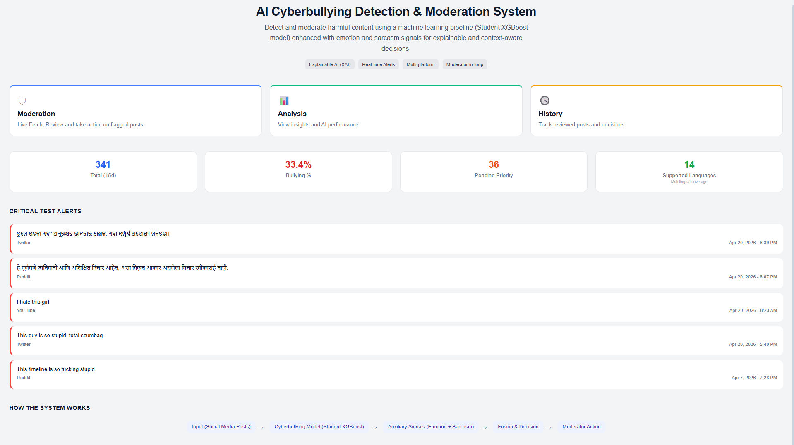
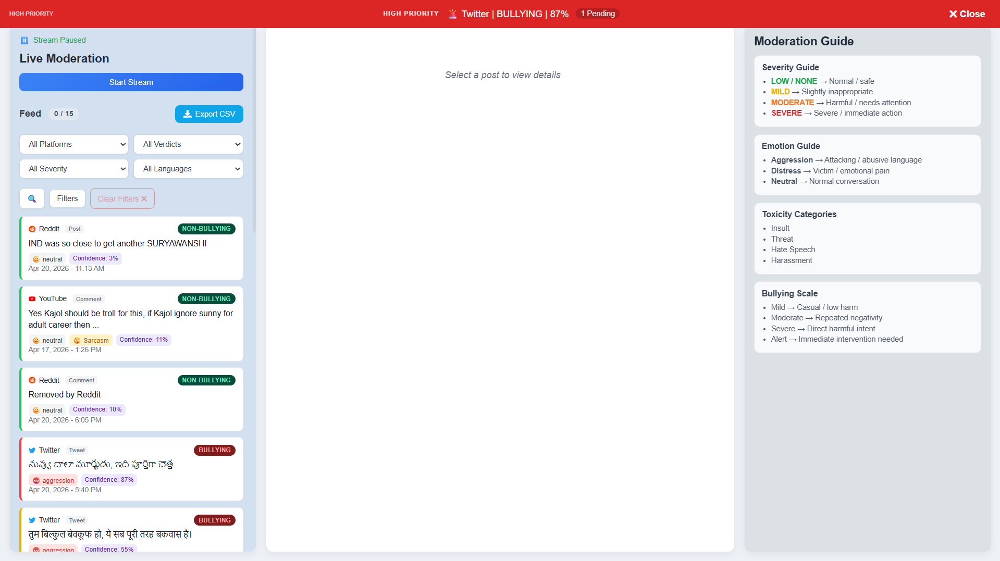
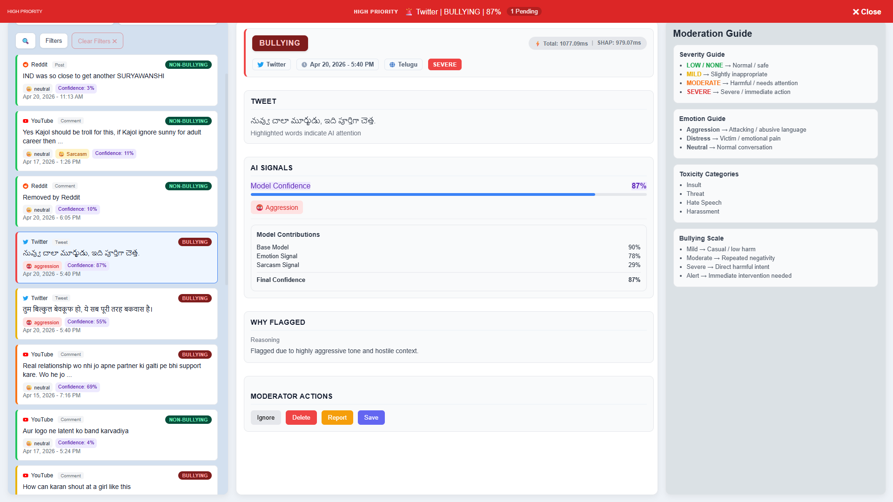
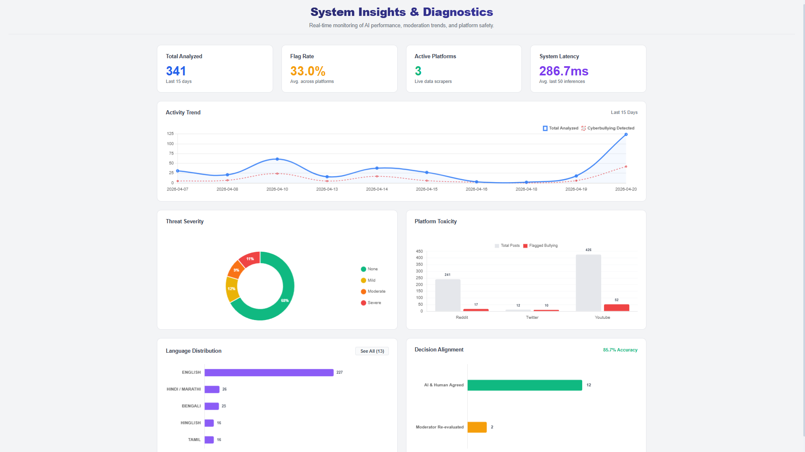
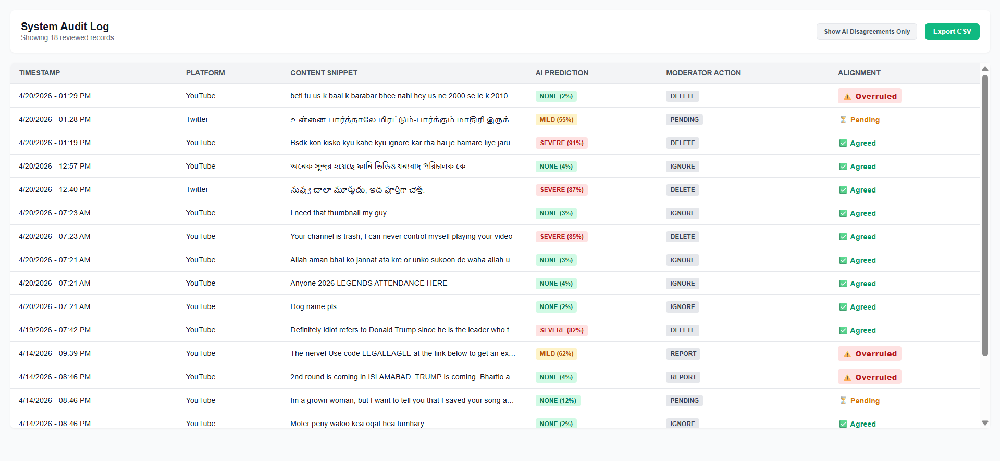

# Real-Time Multilingual Emotion-Aware Cyberbullying Detection System

This repository implements a **production-grade, multilingual cyberbullying detection system** utilizing:

- Multi-Teacher Knowledge Distillation (MTKD)
- Emotion-Aware Analysis
- Sarcasm Detection
- Rule-Based Fusion Engine
- Zero-Latency Explainable AI (SHAP)
- Active Learning / Human-in-the-Loop (HITL) Retraining

The system processes **social media posts and comments** in real-time, predicting cyberbullying toxicity alongside **emotion and sarcasm signals** to provide Trust & Safety moderators with a highly accurate, explainable dashboard.

---

## 🏆 Project Achievements & Core Metrics

Our Multi-Teacher Knowledge Distillation (MTKD) architecture successfully compressed heavy transformer models while maintaining state-of-the-art accuracy.

| Model | Size (MB) | Accuracy | Precision | Recall | F1-Score |
| :--- | :--- | :--- | :--- | :--- | :--- |
| **XLM-R (Teacher)** | 1081.81 | 94.12% | 92.69% | 96.02% | 94.32% |
| **MTKD_XGBoost** | 0.39 | 93.71% | 93.91% | 93.71% | 93.70% |
| **Student_V2** | **0.92** | 91.58% | 93.51% | 89.53% | 98.80% |
| *Baseline XGBoost* | *0.16* | *71.40%* | *67.63%* | *84.06%* | *74.96%* |

**Key Victory:** Achieved ~99.9% reduction in model size (1081MB → 0.92MB) with minimal accuracy loss, enabling real-time inference.

---

## 🏗️ Project Pipeline Overview

```text
Phase 1: Foundational Data Engineering
      ↓
Phase 2: MTKD & Student Training
      ↓
Phase 3: Emotion, Sarcasm & Fusion Layer
      ↓
Phase 4: Real-Time FastAPI & React Dashboard
````

---

## 🗂️ Project Structure

```text
Sem8_Cyber_bullying_detection/
│
├── cyberbullying-frontend/         # Phase 4: React UI Dashboard
├── data/                           # Raw, Processed, and Pipeline Data
├── models/                         # Trained weights (Not tracked in Git)
├── notebooks/                      # Jupyter experiments & analysis
├── resources/
│   └── keywords/                   # Multilingual dictionaries
│
└── src/
    ├── cyberbullying/
    │   ├── api/                    
    │   ├── collector/              
    │   ├── data_collection/        
    │   ├── database/               
    │   ├── distillation/           
    │   ├── emotion/                
    │   ├── evaluation/             
    │   ├── explainability/         
    │   ├── fusion/                 
    │   ├── inference/              
    │   ├── preprocessing/          
    │   ├── sarcasm/                
    │   └── training/               
    │
    └── data_pipeline/              
```

---

## 🚀 Execution Order & Architecture

### Phase 1: Data Engineering & Collection

* `01_build_keywords.py` → Multilingual toxic keyword generation
* `04_scrape_historical_data.py` → Data scraping (Reddit, X, YouTube)
* `preprocess.py` → Cleaning + dataset splitting

---

### Phase 2: MTKD Pipeline

* Teacher Training → Transformer models (MuRIL, mBERT, XLM-R)
* Distillation → Soft label extraction
* Student Training → XGBoost lightweight model

---

### Phase 3: Multimodal Signal Integration

* Emotion Detection → Aggression / Distress
* Sarcasm Detection → Implicit toxicity
* Fusion Engine → Final contextual decision

---

### Phase 4: Real-Time Deployment

* Live Scraper → Real-time ingestion
* FastAPI Backend → Model serving
* SHAP Engine → Zero-latency explanations
* React Dashboard → Moderator interface

**Key Features:**

* System latency ~400ms
* Toxicity density analytics
* HITL retraining dataset generation

---

## 📸 Dashboard Screenshots

### 1) Landing Page



### 2) Moderation Feed




### 3) Analytics Dashboard



### 4) History Page



---

## ⚙️ Setup & Installation

```bash
# Clone repository
git clone <repo-url>

# Install dependencies
pip install -r requirements.txt
```

### Environment Variables (.env)

```env
TWITTER_BEARER_TOKEN=...
YOUTUBE_API_KEY=...
REDDIT_CLIENT_ID=...
```

---

## ⚠️ Model Note

Trained models are **not included** due to size (>1GB).
To reproduce:

* Run notebooks inside `notebooks/experiments/`

---

## 📜 License

This project is intended for academic research and educational use.

```
```
