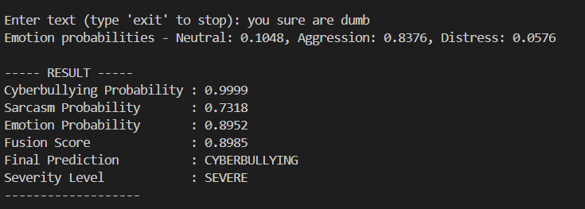
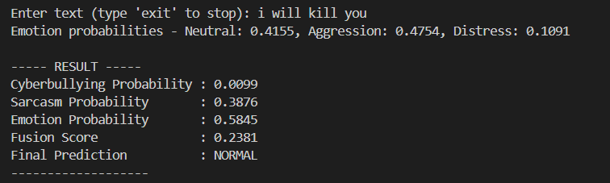
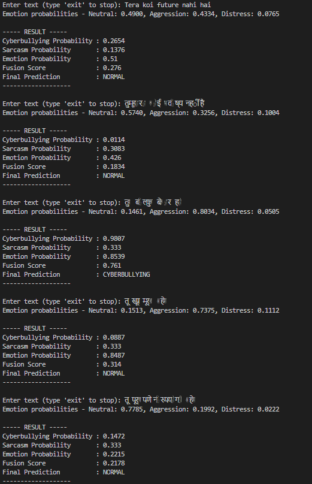

## Overview

This module simulates real-world predictions for the cyberbullying detection system. Its goal is to combine all model components and produce end-to-end inference results for user-provided text.

Phase 3.8 allows testing the system before final integration (Phase 4), ensuring all components—MTKD, sarcasm, and emotion—work together correctly.

## Purpose

Validate the performance of the combined system on real inputs.

Provide probability outputs for each component and a final fusion score.

Enable interactive testing and debugging of the complete pipeline.

## Inputs

The scripts in this folder accept:
Single text input (from user or test dataset)
Optional batch input CSV for evaluation purposes

The text is processed by:
MTKD XGBoost student model → Produces p_cb
Sarcasm BiGRU model → Produces p_sar
Emotion transformer model → Produces p_emo

## Outputs

Each inference returns:

Output	Description
p_cb	Probability of cyberbullying
p_sar	Probability of sarcasm
p_emo	Probability of emotion intensity
fusion_score	Weighted combination of the three probabilities
decision	Binary classification: Bullying / Non-bullying

Example Output:

Input text: "Yeah great job idiot"

Cyberbullying: 0.74
Sarcasm: 0.63
Emotion: 0.52

Final Score: 0.71
Decision: Bullying

## Folder Structure

src/cyberbullying/inference/
│
├── load_models.py           # Loads trained MTKD, sarcasm, and emotion models
├── predict_components.py    # Runs individual models and outputs component probabilities
├── fusion_inference.py      # Computes fusion score and final decision using predefined weights
└── fusion_final_test.py     # Accepts user text input and produces complete system inference

## Workflow

Load Models
load_models.py initializes all trained models in memory.

Predict Component Probabilities
predict_components.py generates p_cb, p_sar, and p_emo for input text.

Compute Fusion Score
fusion_inference.py calculates the weighted fusion score and final decision.

User Interface / Testing
fusion_final_test.py allows users to input text and see real-time predictions.

## Fusion Formula

The same fusion formula from Phase 3.5 is applied:
fusion_score = 0.60 * p_cb + 0.25 * p_sar + 0.15 * p_emo

## Notes

The module simulates a real system but does not serve an API.
Probabilities from individual models are not stored persistently unless required for analysis.
Designed to validate system behavior before moving to Phase 4 — Final System Integration.
Can be extended to batch inference or live deployment with minimal changes.

## Output 

